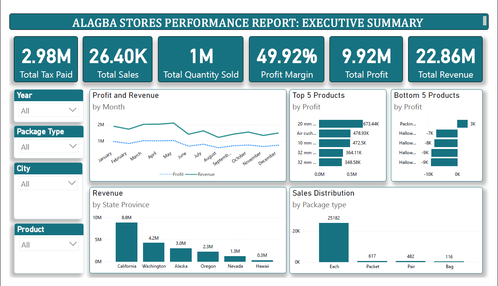

# Alagba Stores Performance Dashboard 

This Power BI project provides an executive summary of store performance, featuring key business metrics such as:

- Total Tax Paid
- Total Sales
- Total Quantity Sold
- Profit Margin
- Total Profit
- Total Revenue

## 📊 Dashboard Features

- **Profit and Revenue by Month:** Time-series view of revenue and profit.
- **Top and Bottom 5 Products by Profit**
- **Revenue by State Province:** Visualizing geographic revenue distribution.
- **Sales Distribution by Package Type**
- **Interactive Filters:** Year, Package Type, City, Product.

## 📁 Project Files

- `executive-summary-final.png` – Snapshot of the final dashboard.

## 📌 Tools & Tech Used

- Power BI
- DAX
- Excel (data preprocessing)

## 💡 Insights

- California generated the highest revenue (~8.8M)
- Major product profits came from 20 mm, Air cushion, and similar items.
- Package type "Each" had the highest sales frequency.

---
